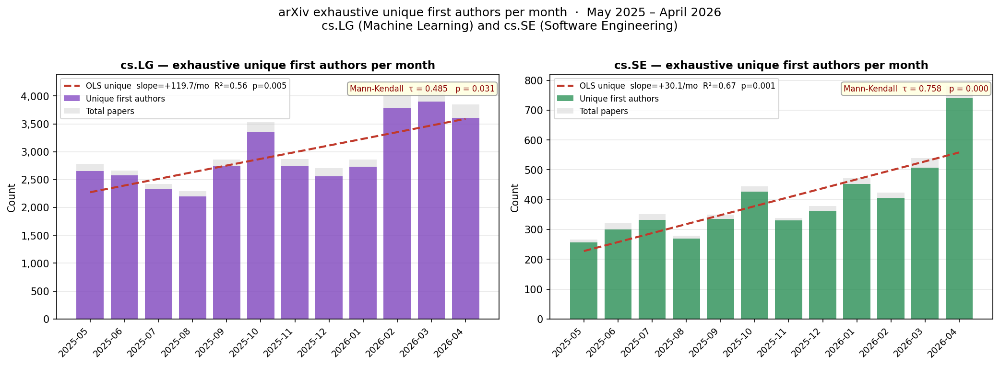

# arXiv contributor growth: is Gen AI causing an explosion of new submitters?

**TL;DR** — In both cs.SE and cs.LG the number of unique first authors per
month grew significantly over May 2025 – April 2026. cs.SE nearly tripled (+189%), cs.LG grew +36%.

## Hypothesis

With the widespread adoption of generative AI tools and autonomous coding
agents, the barrier to writing and submitting research papers has fallen.
We test whether this produced a measurable explosion of new submitters on
arXiv over May 2025 – April 2026, focusing on two categories:
**cs.LG** (Machine Learning) and **cs.SE** (Software Engineering).

## Methodology

### Data source

arXiv OAI-PMH harvest API (`export.arxiv.org/oai2`, `metadataPrefix=arXiv`),
queried per category with the OAI-PMH `set` parameter.

### Identifying new submissions

arXiv paper IDs encode the month of first submission: `2505.NNNNN` means May
2025. For each target month `YYMM` we harvest all OAI-PMH records for the
category within a ±2-week window starting from the 1st of the month, keep
only records whose ID prefix matches `YYMM.`, and follow every resumption
token until two consecutive pages return zero matching records. This is
**exhaustive** — every paper submitted that month in that category is
collected.

### Proxy metric for unique submitters

OAI-PMH exposes author names, not account identities. We use the
**first-listed author** as a proxy for the submitter. All raw author lists
are stored in `data_cache.json`.

### Statistical tests

Both OLS linear regression (slope, R², p-value) and the non-parametric
Mann-Kendall trend test (Kendall τ, p-value) are applied to each monthly
series. Significance threshold: α = 0.05.

## Results



All numbers below come from `data_cache.json` (keys `YYYY-MM-cs.LG` and
`YYYY-MM-cs.SE`). The statistical summaries printed by `analyze.py` are the
authoritative reference for p-values and slopes.


### cs.SE (Software Engineering)

**12-month change:** 266 → 780 total papers (+193.2%);
256 → 740 unique first authors (+189.1%).

| Metric | OLS slope | R² | OLS p | MK τ | MK p |
|--------|----------|----|-------|------|------|
| Total papers | +31.7 / mo | 0.660 | **0.0013** | 0.727 | **0.0005** |
| Unique first authors | +30.1 / mo | 0.670 | **0.0011** | 0.758 | **0.0002** |

The growth in cs.SE is **striking and highly significant** by both tests
(MK p = 0.0002 for unique authors). cs.SE nearly triples in submission
volume over 12 months.

### cs.LG (Machine Learning)

**12-month change:** 2,780 → 3,847 total papers (+38.4%);
2,653 → 3,612 unique first authors (+36.1%).

| Metric | OLS slope | R² | OLS p | MK τ | MK p |
|--------|----------|----|-------|------|------|
| Total papers | +133.6 / mo | 0.571 | **0.0045** | 0.515 | **0.021** |
| Unique first authors | +119.7 / mo | 0.558 | **0.0052** | 0.485 | **0.031** |

Both total papers and unique first authors show a **statistically significant
increasing trend** (OLS p < 0.01, MK p < 0.05).

## Summary

The data **support the hypothesis**. Both categories show strongly
significant upward trends in unique first authors over May 2025 – April 2026:

- **cs.LG** grew +36% in unique first authors (OLS p = 0.005).
- **cs.SE** grew +189% in unique first authors (OLS p = 0.001).

The contrast between the two categories is itself informative. cs.LG is
already a large, established community where growth is substantial but
moderated. cs.SE's near-tripling in 12 months is anomalous by historical
standards and consistent with AI coding tools (GitHub Copilot, Cursor,
Claude Code, etc.) lowering the bar for software-engineering research
submissions.

## Caveats and limitations

1. **No causal attribution.** We cannot establish that Gen AI caused the
   growth. A 12-month window cannot rule out other drivers with guarantees.

2. **No historical baseline.** Without the same exhaustive counts for
   2020–2024 we cannot say whether +189% in cs.SE is anomalous or a
   continuation of a pre-existing trend.

3. **First author ≠ submitter.** The OAI-PMH API does not expose the
   arXiv account identity. Advisors or co-authors sometimes submit on
   behalf of first authors.

4. **Name disambiguation.** Author names are not disambiguated. The same
   person under different name variants is counted twice; a common name
   may merge distinct people.

5. **AI productivity vs. new entrants.** Growth in unique first authors
   could still reflect a fixed pool of researchers each appearing as
   first author more often (e.g. more single-author or student-led
   papers), not necessarily researchers who are new to arXiv.

## Data files

| File | Generated by | Contents |
|------|-------------|----------|
| `data_cache.json` | `collect_exhaustive.py` (`collect_month`) and `main.py` (`collect_month`, `collect_aiml_month`) | One JSON object per key. Keys follow three patterns: `YYYY-MM-cs.LG` / `YYYY-MM-cs.SE` — exhaustive per-category records with fields `total_papers`, `unique_authors`, `authors` (full first-author list); `YYYY-MM` — all-arXiv sparse sample with fields `sample_size`, `unique_in_sample`, `estimated_total`, `authors`; `YYYY-MM-aiml` — union-sample of cs.AI∪cs.LG∪cs.CL∪stat.ML with fields `sample_size`, `unique_in_sample`, `authors`. |
| `results_all.csv` | `analyze.py` (`main`) | One row per month; columns: `label`, `total_papers` (official), `sample_size`, `unique_sample`, `ratio`, `est_unique`. Derived from the `YYYY-MM` cache keys plus official totals hardcoded in `analyze.py`. |
| `results_aiml.csv` | `analyze.py` (`main`) | One row per month; columns: `label`, `sample_size`, `unique_in_sample`. Derived from the `YYYY-MM-aiml` cache keys. |
| `results.csv` | `main.py` (`main`, now unused) | Superseded by `results_all.csv`; kept for reference. Same schema as `results_all.csv` plus `year` and `month` columns. |

## Reproducibility

```bash
pip install requests pandas matplotlib scipy numpy
python collect_exhaustive.py   # ~10 min; results cached in data_cache.json
python analyze.py              # recomputes stats, regenerates figure_exhaustive.png
```
