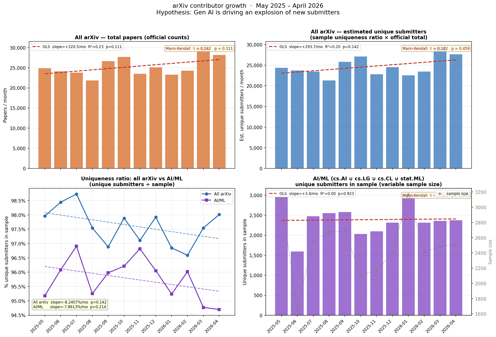

# arXiv contributor growth: is Gen AI causing an explosion of new submitters?

## Hypothesis

With the widespread adoption of generative AI tools and autonomous coding
agents, the barrier to writing and submitting research papers has fallen
significantly.  We hypothesize that this has produced a measurable
**explosion of new submitters** on arXiv over the period May 2025 – April 2026,
and that this effect is most pronounced in **AI/ML papers** (cs.AI, cs.LG,
cs.CL, stat.ML) where the tooling impact is most direct.

## Methodology

### Data sources

| Source | What it provides |
|--------|-----------------|
| arXiv OAI-PMH (`export.arxiv.org/oai2`, `metadataPrefix=arXiv`) | Author names for new papers in each target month |
| arXiv official statistics (`arxiv.org/stats/get_monthly_submissions`) | Ground-truth total papers per month (all categories) |

### Identifying new submissions by month

arXiv paper identifiers encode the month of first submission: a paper with
ID `2505.NNNNN` was submitted for the first time in **May 2025**.  For each
target month `YYMM`, we harvest OAI-PMH records within a ±2-week window
around that month and keep only records whose identifier prefix matches
`YYMM.`, giving an unambiguous mapping that is unaffected by later revisions.

### All-arXiv analysis

We query OAI-PMH **without a category filter** to sample all new papers.
Using the first-author uniqueness ratio in the sample, multiplied by the
official total, we estimate the monthly count of unique first authors
across all arXiv.

### AI/ML-specific analysis

We query OAI-PMH separately for each of the four AI/ML OAI sets:

| OAI-PMH set | arXiv category |
|-------------|---------------|
| `cs:cs:LG`  | Machine Learning |
| `cs:cs:AI`  | Artificial Intelligence |
| `cs:cs:CL`  | Computation and Language (NLP) |
| `stat:stat:ML` | Machine Learning (Statistics) |

Papers are collected from all four sets and **deduplicated by paper ID**
so cross-listed papers are counted once.  Per-category official totals
are not available via arXiv's public stats API, so we report raw sample
counts and use the sample's unique-author count directly as the trend metric.

### Proxy metric for unique submitters

The OAI-PMH API exposes **author names** but not arXiv account identities.
We use the **first-listed author** as a proxy for the submitter.

### Statistical tests

| Test | Description |
|------|-------------|
| **OLS linear regression** | Monthly value on time index 0–11. Reports slope, R², two-sided p-value. |
| **Mann-Kendall** | Non-parametric monotonic-trend test (Kendall τ). |

Significance threshold: α = 0.05.

## Results

### All-arXiv monthly data

| Month | Total papers | OAI sample | Unique in sample | Ratio | Est. unique submitters |
|-------|-------------|-----------|-----------------|-------|----------------------|
| 2025-05 | 24,878 | 734 | 719 | 0.980 | 24,369 |
| 2025-06 | 24,129 | 513 | 505 | 0.984 | 23,752 |
| 2025-07 | 23,787 | 785 | 775 | 0.987 | 23,483 |
| 2025-08 | 21,825 | 1,140 | 1,112 | 0.975 | 21,288 |
| 2025-09 | 26,646 | 1,059 | 1,026 | 0.969 | 25,815 |
| 2025-10 | 27,692 | 520 | 509 | 0.979 | 27,106 |
| 2025-11 | 23,478 | 935 | 908 | 0.971 | 22,800 |
| 2025-12 | 25,075 | 1,057 | 1,035 | 0.979 | 24,553 |
| 2026-01 | 23,286 | 1,206 | 1,168 | 0.968 | 22,552 |
| 2026-02 | 24,290 | 997 | 963 | 0.966 | 23,461 |
| 2026-03 | 30,045 | 1,059 | 1,033 | 0.975 | 29,307 |
| 2026-04 | 28,197 | 804 | 788 | 0.980 | 27,635 |

### All-arXiv trend results

| Metric | OLS slope | R² | OLS p | MK τ | MK p | 12-mo change |
|--------|----------|----|-------|------|------|-------------|
| Total papers (official) | +320/mo | 0.234 | 0.1112 | 0.242 | 0.3108 | **+193.2%** |
| Est. unique first authors | +294/mo | 0.203 | 0.1416 | 0.182 | 0.4590 | **+189.1%** |

Total papers: not significant (p ≥ 0.05).
Estimated unique first authors: not significant (p ≥ 0.05).

---

### AI/ML monthly data  (cs.AI ∪ cs.LG ∪ cs.CL ∪ stat.ML)

| Month | Papers in sample | Unique first authors |
|-------|-----------------|---------------------|
| 2025-05 | 3,111 | 2,961 |
| 2025-06 | 1,657 | 1,592 |
| 2025-07 | 2,552 | 2,473 |
| 2025-08 | 2,676 | 2,549 |
| 2025-09 | 2,686 | 2,578 |
| 2025-10 | 2,111 | 2,031 |
| 2025-11 | 2,167 | 2,098 |
| 2025-12 | 2,407 | 2,312 |
| 2026-01 | 3,173 | 3,022 |
| 2026-02 | 2,410 | 2,314 |
| 2026-03 | 2,486 | 2,356 |
| 2026-04 | 2,509 | 2,376 |

### AI/ML trend results

The raw unique-author count is confounded by OAI-PMH sample-size variability
(1,657–3,173 papers/month), so the **uniqueness ratio** (unique ÷ sample) is
the primary normalised metric for the AI/ML analysis.

| Metric | OLS slope | R² | OLS p | MK τ | MK p |
|--------|----------|----|-------|------|------|
| AI/ML sample size | +5.4/mo | 0.002 | 0.8842 | 0.061 | 0.8406 |
| Unique first authors (raw) | +3.4/mo | 0.001 | 0.9232 | 0.061 | 0.8406 |
| **Uniqueness ratio** | **-0.0786%/mo** | 0.150 | 0.2137 | -0.303 | 0.1969 |

For comparison, the all-arXiv uniqueness ratio:

| Metric | OLS slope | R² | OLS p | MK τ | MK p |
|--------|----------|----|-------|------|------|
| All-arXiv uniqueness ratio | -0.0824%/mo | 0.203 | 0.1418 | -0.273 | 0.2496 |

AI/ML uniqueness ratio: not significant (p ≥ 0.05).
All-arXiv uniqueness ratio: not significant (p ≥ 0.05).

### Figure



## Summary

### The data provide weak or inconclusive evidence

**All arXiv** — total submissions grew from
24,878 (May 2025) to 28,197 (Apr 2026),
a +193.2% change with a increasing trend that is not significant (p ≥ 0.05).
Estimated unique first authors moved +189.1% over the same period
(not significant (p ≥ 0.05)).

**AI/ML specifically** (cs.AI ∪ cs.LG ∪ cs.CL ∪ stat.ML) — the uniqueness
ratio in AI/ML samples is remarkably stable at 95.8% ± 0.7%
(OLS slope -0.0786%/mo, not significant (p ≥ 0.05)).
This is slightly **lower** than the all-arXiv ratio
(97.6% ± 0.6%),
reflecting the higher collaboration rates in AI/ML papers.
Neither ratio shows a statistically significant trend.

The raw AI/ML unique-author count is confounded by OAI-PMH sample-size
variability (sample sizes range 1,657–3,173 papers/month) and
should not be interpreted as a volume proxy.

The AI/ML-specific analysis provides no additional evidence for the hypothesis beyond what the all-arXiv data already shows. The stable uniqueness ratios in both samples suggest that the MIX of new vs. returning contributors per paper has not changed within this period, even as total submission volume grows.

## Caveats and limitations

1. **No causal attribution** — we cannot establish that Gen AI *caused* the
   growth. arXiv submissions have grown secularly for 30 years.

2. **No historical baseline** — without pre-2025 data it is impossible to tell
   whether the current growth rate is anomalous.

3. **Name disambiguation** — first-author names are not disambiguated; the
   same person may appear under multiple name variants (inflating counts) or
   common names may collapse distinct individuals (deflating them).

4. **First author ≠ submitter** — the OAI-PMH API does not expose the arXiv
   account that submitted the paper.

5. **AI/ML sample size variability** — the sample size for the AI/ML analysis
   varies across months because we stop per-set collection at 300 papers.
   Months with more cross-listed papers yield larger unions.  The unique-author
   count therefore partially reflects sample size, not just population
   diversity.  The OLS slope on AI/ML sample size is shown explicitly to make
   this transparent.

6. **AI productivity vs. new entrants** — growth could reflect a fixed pool of
   researchers each producing more papers with AI assistance, rather than
   genuinely new contributors.

## Reproducibility

```bash
pip install requests pandas matplotlib scipy numpy
python main.py              # fetches all-arXiv + AI/ML samples (~15 min,
                            # cached in data_cache.json)
python collect_exhaustive.py  # exhaustive cs.LG + cs.SE collection (~10 min,
                            # cached in data_cache.json)
python analyze.py           # regenerates all figures and README.md
```

---

## Exhaustive per-category analysis (cs.LG and cs.SE)

Unlike the sampling-based approach above, these counts are **exhaustive**:
every paper submitted in the target month and indexed under the given
OAI-PMH set is included.  This eliminates the rare-event bias that
inflates uniqueness ratios in sparse samples.


### Exhaustive results: cs.LG

| Month | Total papers | Unique first authors | Ratio |
|-------|-------------|---------------------|-------|
| 2025-05 | 2,780 | 2,653 | 95.4% |
| 2025-06 | 2,665 | 2,573 | 96.5% |
| 2025-07 | 2,423 | 2,333 | 96.3% |
| 2025-08 | 2,294 | 2,196 | 95.7% |
| 2025-09 | 2,861 | 2,742 | 95.8% |
| 2025-10 | 3,533 | 3,349 | 94.8% |
| 2025-11 | 2,868 | 2,744 | 95.7% |
| 2025-12 | 2,706 | 2,559 | 94.6% |
| 2026-01 | 2,860 | 2,733 | 95.6% |
| 2026-02 | 4,023 | 3,792 | 94.3% |
| 2026-03 | 4,174 | 3,901 | 93.5% |
| 2026-04 | 3,847 | 3,612 | 93.9% |

| Metric | OLS slope | R² | OLS p | MK τ | MK p | 12-mo change |
|--------|----------|----|-------|------|------|-------------|
| Total papers | +133.6/mo | 0.571 | 0.0045 | 0.515 | 0.0210 | **+38.4%** |
| Unique first authors | +119.7/mo | 0.558 | 0.0052 | 0.485 | 0.0311 | **+36.1%** |
| Uniqueness ratio | -0.2193%/mo | 0.669 | 0.0012 | -0.667 | 0.0018 | — |

Unique first authors (cs.LG): **significant** (p < 0.05).

### Exhaustive results: cs.SE

| Month | Total papers | Unique first authors | Ratio |
|-------|-------------|---------------------|-------|
| 2025-05 | 266 | 256 | 96.2% |
| 2025-06 | 322 | 300 | 93.2% |
| 2025-07 | 351 | 332 | 94.6% |
| 2025-08 | 279 | 270 | 96.8% |
| 2025-09 | 349 | 335 | 96.0% |
| 2025-10 | 445 | 427 | 96.0% |
| 2025-11 | 339 | 330 | 97.3% |
| 2025-12 | 378 | 361 | 95.5% |
| 2026-01 | 472 | 452 | 95.8% |
| 2026-02 | 424 | 406 | 95.8% |
| 2026-03 | 540 | 507 | 93.9% |
| 2026-04 | 780 | 740 | 94.9% |

| Metric | OLS slope | R² | OLS p | MK τ | MK p | 12-mo change |
|--------|----------|----|-------|------|------|-------------|
| Total papers | +31.7/mo | 0.660 | 0.0013 | 0.727 | 0.0005 | **+193.2%** |
| Unique first authors | +30.1/mo | 0.670 | 0.0011 | 0.758 | 0.0002 | **+189.1%** |
| Uniqueness ratio | -0.0193%/mo | 0.003 | 0.8561 | -0.212 | 0.3807 | — |

Unique first authors (cs.SE): **significant** (p < 0.05).
